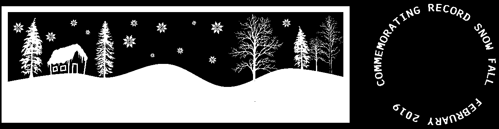
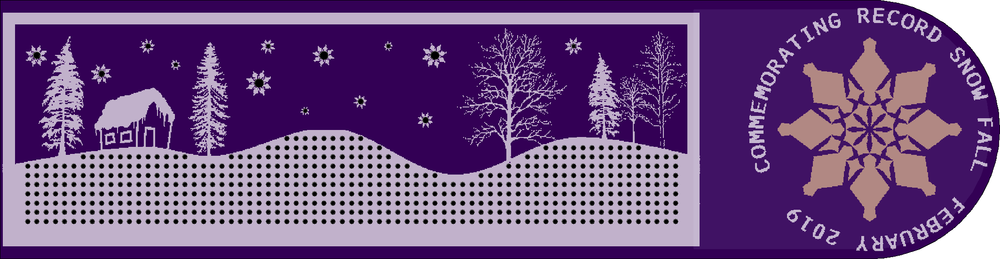

# NOTES

The goal here was to work on the process for bringing in custom art for silk, etc.

### The Process
This process could be generalized to anything that produces a BMP. However, using Inkscape made setting the document properties easier.

* Inkscape
  * Set up document to match board dimensions
  * Make drawing
  * Export PNG
  * Set DPI, ex: 300
* Gimp
  * Convert PNG to BMP
  * since Inkscape only exports PNG and Eagle only imports BMP
* Eagle
  * File -> Import -> Bitmap...
  * match DPI to above
  * pick color and destination layer

### Multi-layer specifics
When you import the BMP into Eagle you can specify any destination layer. This lets you
get creative with things like the stop layer to expose copper. The general process that
was done for this board went something like:

* Inkscape
  * Create layers to match the Eagle layers names
    * tPlace
    * tStop
    * etc.
  * Set the colors for these layers to match board fab
    * tPlace = white for silk
    * tStop = yellow-ish for exposed copper
  * Make the layer specific drawings on these layers
  * Output multipe PNGs
    * Turn off all other layers
    * Export to PNG with visible layer name, ex: tPlace.png
  * Convert PNGs as above
  * When importing in Eagle, match the name to the layer

For example, these were the BMPs used for the top silk layer:

and the top stop layer:

which combined to form the white silk and exposed copper:

