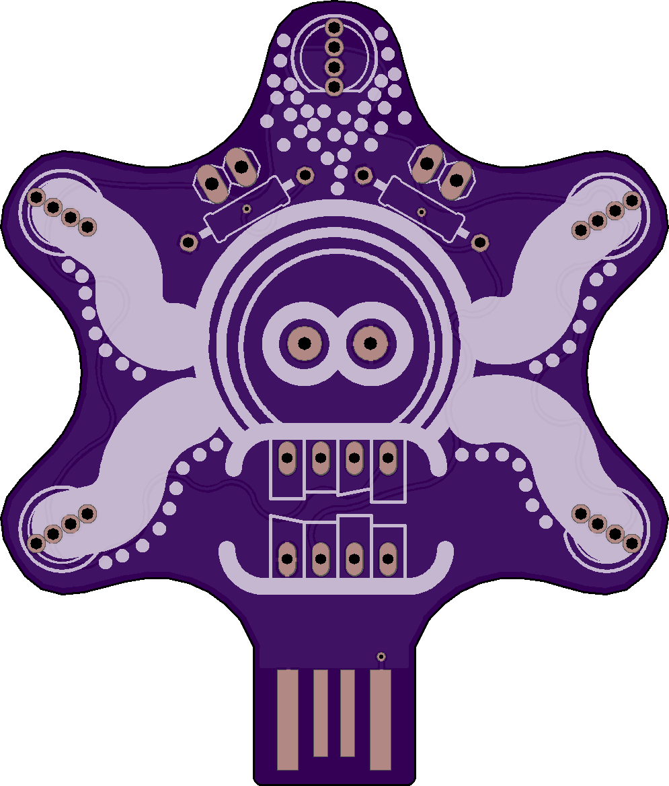
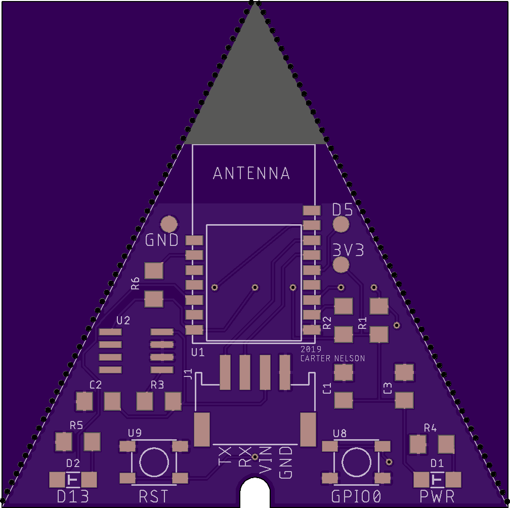
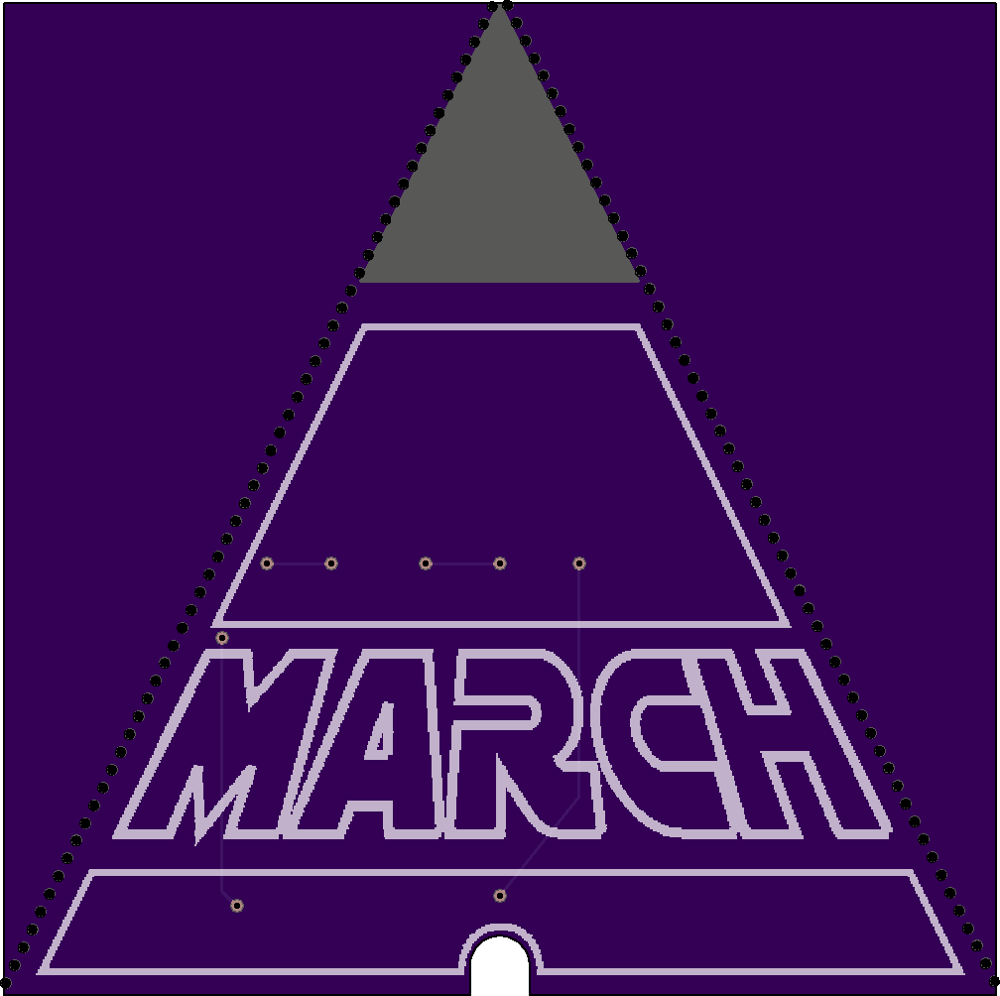
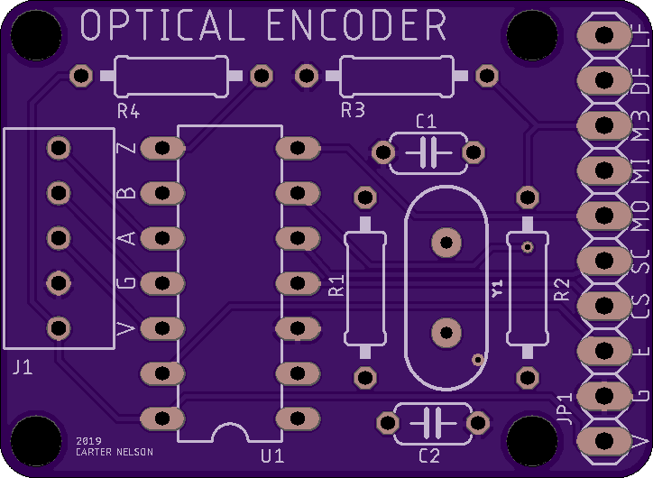
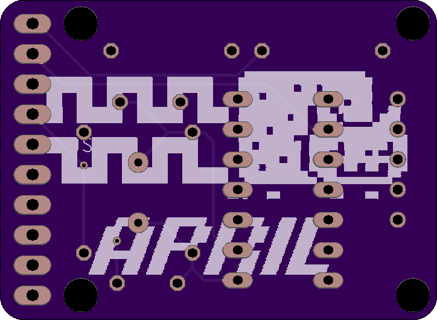
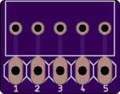
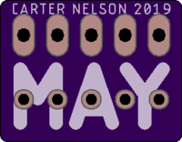
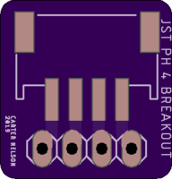

# 2019-PCBs-Just-4-Fun
One PCB a month. Just 4 Fun.

# January

USB powered tamagotchi thing with an ATtiny85 brain.

# February

A backlit commemorative plaque thing.

# March

An IoT pyramid thing.

# April

Optical encoder reader with SPI interface.

# May

Terminal block to breadboard adapter.

# June

JST PH 4 to breadboard adapter.
